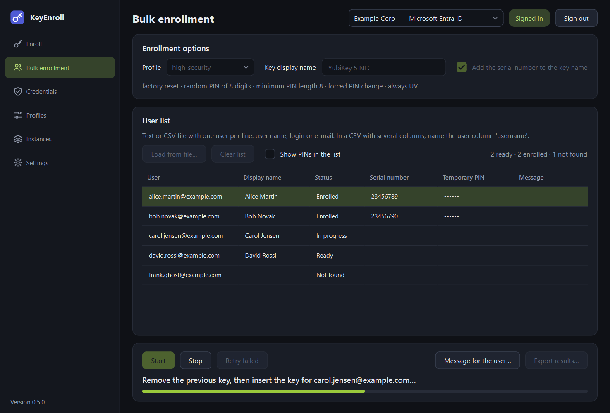
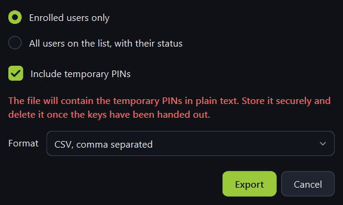

# Bulk enrollment

The **Bulk enrollment** page enrolls keys for a whole list of users: you load the
list from a file, insert one key after another, and export the result — including the
temporary PINs — when you are done.

{ .shot }

## Preparing the user list

Use a plain text file or a CSV file with **one user per line**: the user name, login
or e-mail address, in the form your identity provider knows.

=== "Text file"

    ```text
    alice.martin@example.com
    bob.novak@example.com
    # lines starting with # are ignored
    carol.jensen@example.com
    ```

=== "CSV with several columns"

    ```text
    department;username;location
    Sales;alice.martin@example.com;Berlin
    Sales;bob.novak@example.com;Warsaw
    ```

Rules:

- In a CSV with several columns, name the user column `username`. `login`, `upn`,
  `userPrincipalName`, `email` and `mail` are recognised too, as are the column names
  KeyEnroll itself writes when it exports a list. Without a recognised header the
  **first column** is used.
- Columns may be separated by semicolons, commas or tabs.
- Empty lines and lines starting with `#` are skipped; a user listed twice is taken
  once.
- Files saved by Excel or Notepad work as they are (UTF-8, UTF-16 and Windows
  encodings are detected).

## The page

**Enrollment options** (top)

| Control | What it is for |
|---|---|
| **Profile** | The [profile](profiles.md) applied to every key of the batch. The line below summarises it. |
| **Key display name** | The name given to every key. Combine it with the serial number to tell the keys apart. |
| **Add the serial number to the key name** | Appends each key's own serial number. |

**User list** (middle)

| Control | What it is for |
|---|---|
| **Load from file…** | Loads the list and looks every user up in the directory. |
| **Clear list** | Empties the list. Asks first if there are PINs you have not exported. |
| **Show PINs in the list** | Shows the temporary PINs instead of dots. Leave it off if someone can see your screen. |
| Summary on the right | How many users are ready, enrolled, failed and not found. |
| The list | One row per user: status, serial number of the key they received, temporary PIN, and a message if something went wrong. |

**Actions** (bottom)

| Control | What it is for |
|---|---|
| **Start** | Begins or continues the batch with the next user that is *Ready*. |
| **Stop** | Appears while a batch runs. Stops after the current step; the user in progress goes back to *Ready*. |
| **Retry failed** | Puts failed rows back in the queue. |
| **Message for the user…** | For the selected enrolled user, opens the same [hand-over window](enroll.md#handing-the-key-over) as after a single enrollment. |
| **Export results…** | Saves the list as a CSV file. |
| Status line and progress bar | Tell you which key to insert and how far the batch is. |

## Statuses

| Status | Meaning |
|---|---|
| Checking… | The user is being looked up in the directory. |
| Ready | Found; waiting for a key. |
| Not found | No such user at the identity provider. The row is skipped. Correct the file and load it again. |
| In progress | This user's key is being enrolled right now. |
| Enrolled | Done. The row shows the serial number and the PIN. |
| Failed | Something went wrong; the *Message* column says what. |

## Running a batch

1. Sign in, load the list, and choose the profile and the key name.
2. Press **Start** and confirm. The confirmation says how many keys will be enrolled
   and, if the profile resets keys, that every inserted key will be erased.
3. Insert the key for the first user when asked. A key you insert at that moment is
   reset straight away and you only have to touch it. A key that was already plugged
   in when you pressed Start has to be removed and inserted once.
4. Touch the key again to create the credential.
5. When the row turns to *Enrolled*, **remove the key**, label it for its user, and
   insert the next one.

The list can be sorted while the batch runs; the keys are still enrolled in the
order of the file.

### Built-in safeguards

- The previous key has to be removed before the next user is started, so one key
  cannot be enrolled twice by accident.
- A key whose serial number was already used in this batch is refused **before** it
  is reset.
- The batch works with exactly one connected key. If several are connected when you
  press Start, it stops and asks you to leave only one.
- After a failure the batch **stops** rather than moving on, so that a wrong key or
  an expired sign-in does not burn through the list. Fix the cause and press
  **Start** or **Retry failed**.
- The list belongs to the instance it was loaded for. If you switch to another
  instance, the list is locked until you switch back or clear it.

## Exporting the results

{ .shot .dialog }

| Option | What it is for |
|---|---|
| **Enrolled users only** | A deployment report: only the users who received a key. |
| **All users on the list, with their status** | Everything, including users who failed or were not found. |
| **Include temporary PINs** | Leave on for the list you use to hand the keys out. Turn off for a report you share or archive: the PIN column is left out entirely. |
| **Format** | Semicolon- or comma-separated CSV. Spreadsheet programs in most European languages expect semicolons. |

The file contains: user name, display name, e-mail, status, serial number, key name,
temporary PIN, time of enrollment and message. It opens directly in Excel and
LibreOffice. Random PINs never start with a zero, so a spreadsheet cannot shorten them.

!!! warning "The export contains PINs in plain text"
    Keep the file only as long as you need it to hand the keys out, store it where
    only you can read it, and delete it afterwards. Temporary PINs exist **only in
    the memory of the application** until you export them: KeyEnroll asks before you
    clear the list or close the window with unexported PINs, but it cannot bring
    them back afterwards.
