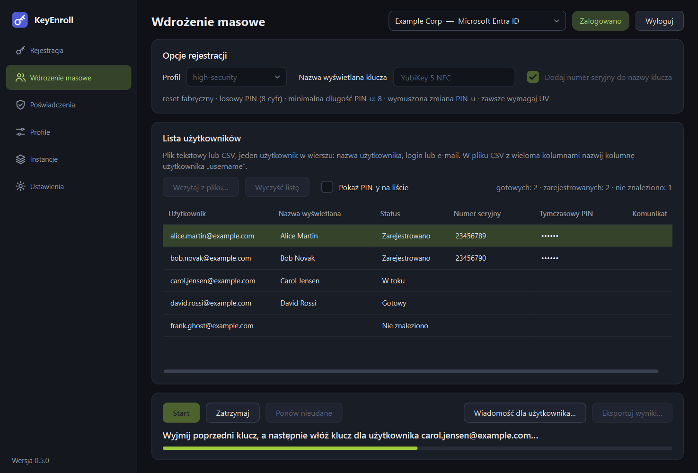
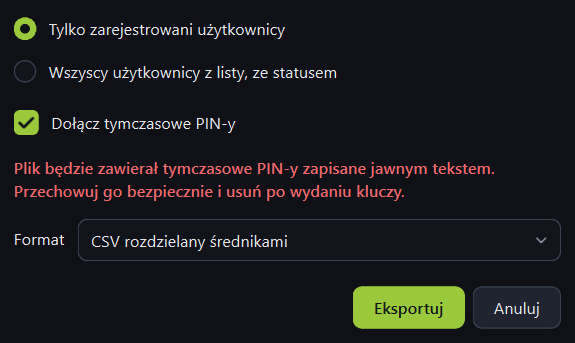

# Wdrożenie masowe

Strona **Wdrożenie masowe** rejestruje klucze dla całej listy użytkowników: wczytujesz
listę z pliku, wkładasz klucz po kluczu, a na końcu eksportujesz wynik — razem
z tymczasowymi PIN-ami.

{ .shot }

## Przygotowanie listy użytkowników

Użyj pliku tekstowego lub CSV z **jednym użytkownikiem w wierszu**: nazwą
użytkownika, loginem lub adresem e-mail — w postaci znanej dostawcy tożsamości.

=== "Plik tekstowy"

    ```text
    alice.martin@example.com
    bob.novak@example.com
    # wiersze zaczynające się od # są pomijane
    carol.jensen@example.com
    ```

=== "CSV z wieloma kolumnami"

    ```text
    dzial;username;lokalizacja
    Sprzedaz;alice.martin@example.com;Berlin
    Sprzedaz;bob.novak@example.com;Warszawa
    ```

Zasady:

- W pliku CSV z wieloma kolumnami nazwij kolumnę użytkownika `username`. Rozpoznawane
  są też `login`, `upn`, `userPrincipalName`, `email` i `mail`, `nazwa użytkownika`
  oraz nazwy kolumn, które KeyEnroll sam zapisuje przy eksporcie listy. Bez
  rozpoznanego nagłówka używana jest **pierwsza kolumna**.
- Kolumny mogą być rozdzielone średnikami, przecinkami lub tabulatorami.
- Puste wiersze i wiersze zaczynające się od `#` są pomijane; użytkownik wpisany
  dwa razy jest brany raz.
- Pliki zapisane przez Excela lub Notatnik działają bez przeróbek (wykrywane są
  kodowania UTF-8, UTF-16 i kodowania Windows).

## Strona

**Opcje rejestracji** (u góry)

| Element | Do czego służy |
|---|---|
| **Profil** | [Profil](profiles.md) stosowany do każdego klucza we wdrożeniu. Wiersz poniżej streszcza jego opcje. |
| **Nazwa wyświetlana klucza** | Nazwa nadawana każdemu kluczowi. Połącz ją z numerem seryjnym, żeby rozróżniać klucze. |
| **Dodaj numer seryjny do nazwy klucza** | Dopisuje numer seryjny danego klucza. |

**Lista użytkowników** (środek)

| Element | Do czego służy |
|---|---|
| **Wczytaj z pliku…** | Wczytuje listę i sprawdza każdego użytkownika w katalogu. |
| **Wyczyść listę** | Opróżnia listę. Najpierw pyta, jeśli są PIN-y, których nie wyeksportowano. |
| **Pokaż PIN-y na liście** | Pokazuje tymczasowe PIN-y zamiast kropek. Zostaw wyłączone, jeśli ktoś może widzieć Twój ekran. |
| Podsumowanie po prawej | Ilu użytkowników jest gotowych, zarejestrowanych, nieudanych i nieznalezionych. |
| Lista | Jeden wiersz na użytkownika: status, numer seryjny otrzymanego klucza, tymczasowy PIN i komunikat, jeśli coś poszło nie tak. |

**Działania** (na dole)

| Element | Do czego służy |
|---|---|
| **Start** | Rozpoczyna lub kontynuuje wdrożenie od następnego użytkownika ze statusem *Gotowy*. |
| **Zatrzymaj** | Pojawia się w trakcie wdrożenia. Zatrzymuje je po bieżącym kroku; użytkownik w toku wraca do statusu *Gotowy*. |
| **Ponów nieudane** | Przywraca nieudane wiersze do kolejki. |
| **Wiadomość dla użytkownika…** | Dla zaznaczonego, zarejestrowanego użytkownika otwiera to samo [okno przekazania](enroll.md#handing-the-key-over) co po pojedynczej rejestracji. |
| **Eksportuj wyniki…** | Zapisuje listę do pliku CSV. |
| Wiersz stanu i pasek postępu | Mówią, który klucz włożyć i jak daleko jest wdrożenie. |

## Statusy

| Status | Znaczenie |
|---|---|
| Sprawdzanie… | Użytkownik jest wyszukiwany w katalogu. |
| Gotowy | Znaleziony; czeka na klucz. |
| Nie znaleziono | U dostawcy tożsamości nie ma takiego użytkownika. Wiersz jest pomijany. Popraw plik i wczytaj go ponownie. |
| W toku | Klucz tego użytkownika jest właśnie rejestrowany. |
| Zarejestrowano | Gotowe. Wiersz pokazuje numer seryjny i PIN. |
| Niepowodzenie | Coś poszło nie tak; kolumna *Komunikat* mówi co. |

## Przebieg wdrożenia

1. Zaloguj się, wczytaj listę, wybierz profil i nazwę klucza.
2. Kliknij **Start** i potwierdź. Okno potwierdzenia mówi, ile kluczy zostanie
   zarejestrowanych, a jeśli profil resetuje klucze — że każdy włożony klucz zostanie
   wyczyszczony.
3. Włóż klucz dla pierwszego użytkownika, gdy aplikacja o to poprosi. Klucz włożony
   w tym momencie jest resetowany od razu i wystarczy go dotknąć. Klucz, który był
   już włożony w chwili kliknięcia Start, trzeba raz wyjąć i włożyć.
4. Dotknij klucza ponownie, żeby utworzyć poświadczenie.
5. Gdy wiersz zmieni status na *Zarejestrowano*, **wyjmij klucz**, opisz go dla
   użytkownika i włóż następny.

Listę można sortować w trakcie wdrożenia; klucze i tak są rejestrowane w kolejności
z pliku.

### Wbudowane zabezpieczenia

- Przed następnym użytkownikiem trzeba wyjąć poprzedni klucz, więc jednego klucza
  nie da się przez pomyłkę zarejestrować dwa razy.
- Klucz o numerze seryjnym użytym już w tym wdrożeniu jest odrzucany **przed**
  resetem.
- Wdrożenie pracuje z dokładnie jednym podłączonym kluczem. Jeśli w chwili
  kliknięcia Start podłączonych jest kilka, zatrzymuje się i prosi o zostawienie
  jednego.
- Po błędzie wdrożenie **zatrzymuje się**, zamiast iść dalej — zły klucz albo
  wygasłe logowanie nie „przepali” całej listy. Usuń przyczynę i kliknij **Start**
  lub **Ponów nieudane**.
- Lista należy do instancji, dla której ją wczytano. Po przełączeniu na inną
  instancję lista jest zablokowana, dopóki nie wrócisz albo jej nie wyczyścisz.

## Eksport wyników

{ .shot .dialog }

| Opcja | Do czego służy |
|---|---|
| **Tylko zarejestrowani użytkownicy** | Raport z wdrożenia: tylko osoby, które dostały klucz. |
| **Wszyscy użytkownicy z listy, ze statusem** | Wszystko, łącznie z nieudanymi i nieznalezionymi. |
| **Dołącz tymczasowe PIN-y** | Zostaw włączone dla listy, z którą wydajesz klucze. Wyłącz dla raportu, który udostępniasz lub archiwizujesz: kolumna z PIN-em jest wtedy całkowicie pomijana. |
| **Format** | CSV rozdzielany średnikami lub przecinkami. Arkusze kalkulacyjne w języku polskim i większości języków europejskich oczekują średników. |

Plik zawiera: nazwę użytkownika, nazwę wyświetlaną, e-mail, status, numer seryjny,
nazwę klucza, tymczasowy PIN, datę rejestracji i komunikat. Otwiera się bezpośrednio
w Excelu i LibreOffice. Losowe PIN-y nigdy nie zaczynają się od zera, więc arkusz
ich nie skróci.

!!! warning "Eksport zawiera PIN-y jawnym tekstem"
    Trzymaj plik tylko tak długo, jak jest potrzebny do wydania kluczy, w miejscu
    dostępnym wyłącznie dla Ciebie, a potem go usuń. Tymczasowe PIN-y istnieją
    **tylko w pamięci aplikacji**, dopóki ich nie wyeksportujesz: KeyEnroll pyta,
    zanim wyczyścisz listę lub zamkniesz okno z niewyeksportowanymi PIN-ami, ale
    później nie da się ich odzyskać.
