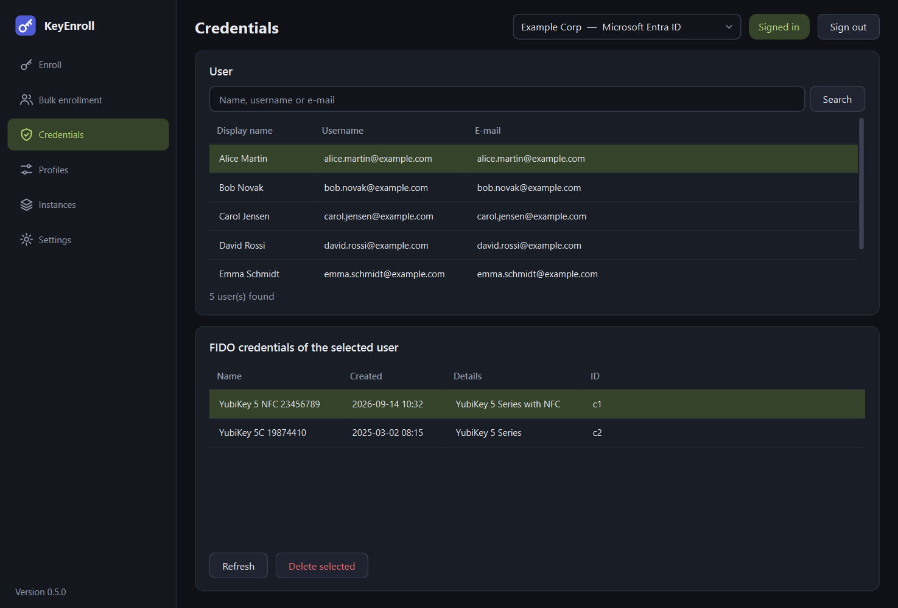

# Credentials

The **Credentials** page shows which FIDO security keys a user has registered at the
identity provider, and lets you delete one — for example when a key is lost or an
employee returns it.

{ .shot }

## The page

**User** (top). Search for the user and select them, exactly as on the
[Enroll page](enroll.md#1-user).

**FIDO credentials of the selected user** (bottom)

| Column | Meaning |
|---|---|
| **Name** | The name the key was registered under. |
| **Created** | When it was registered. |
| **Details** | What the provider knows about the key, usually its model. |
| **ID** | The provider's identifier of the credential. |

| Button | What it is for |
|---|---|
| **Refresh** | Reads the list again. |
| **Delete selected** | Removes the selected credential from the user's account, after a confirmation. |

!!! danger "Deleting cannot be undone"
    The user can no longer sign in with that key as soon as the credential is
    deleted. To use the key again it has to be enrolled again. Deleting here does
    not touch the key itself: its PIN and its other credentials stay as they are.

## What each provider supports

| Identity provider | List | Delete |
|---|---|---|
| Microsoft Entra ID | yes | yes |
| Okta | yes | yes |
| PingOne PingID | yes | yes |
| PingOne Advanced Identity Cloud | no | no |

PingOne Advanced Identity Cloud does not offer an interface for this; manage the
credentials in its administration console instead. The page says so when such an
instance is selected.
