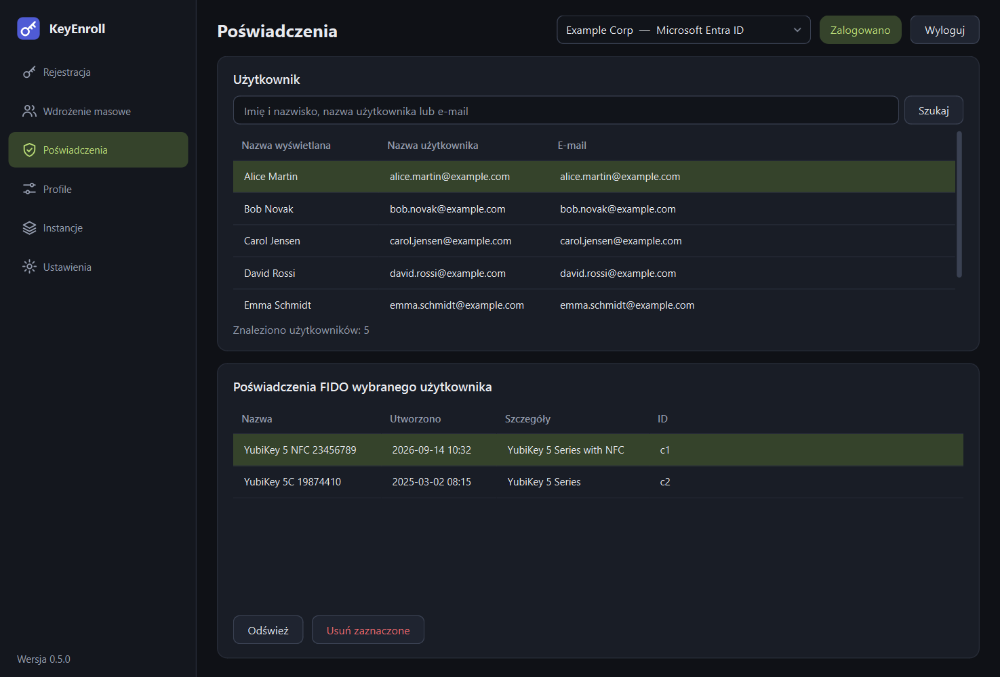

# Poświadczenia

Strona **Poświadczenia** pokazuje, jakie klucze FIDO użytkownik ma zarejestrowane
u dostawcy tożsamości, i pozwala usunąć wybrany — na przykład gdy klucz zaginął albo
pracownik go zwrócił.

{ .shot }

## Strona

**Użytkownik** (u góry). Wyszukaj użytkownika i zaznacz go — tak samo jak na
[stronie Rejestracja](enroll.md#1-user).

**Poświadczenia FIDO wybranego użytkownika** (na dole)

| Kolumna | Znaczenie |
|---|---|
| **Nazwa** | Nazwa, pod którą klucz został zarejestrowany. |
| **Utworzono** | Kiedy został zarejestrowany. |
| **Szczegóły** | Co dostawca wie o kluczu, zwykle jego model. |
| **ID** | Identyfikator poświadczenia u dostawcy. |

| Przycisk | Do czego służy |
|---|---|
| **Odśwież** | Odczytuje listę ponownie. |
| **Usuń zaznaczone** | Po potwierdzeniu usuwa zaznaczone poświadczenie z konta użytkownika. |

!!! danger "Usunięcia nie da się cofnąć"
    Po usunięciu poświadczenia użytkownik od razu traci możliwość logowania tym
    kluczem. Żeby znów go używać, klucz trzeba zarejestrować od nowa. Usunięcie
    tutaj nie zmienia niczego na samym kluczu: jego PIN i pozostałe poświadczenia
    zostają.

## Co obsługują dostawcy

| Dostawca tożsamości | Lista | Usuwanie |
|---|---|---|
| Microsoft Entra ID | tak | tak |
| Okta | tak | tak |
| PingOne PingID | tak | tak |
| PingOne Advanced Identity Cloud | nie | nie |

PingOne Advanced Identity Cloud nie udostępnia do tego interfejsu; poświadczeniami
zarządza się w jego konsoli administracyjnej. Strona informuje o tym, gdy wybrana
jest taka instancja.
