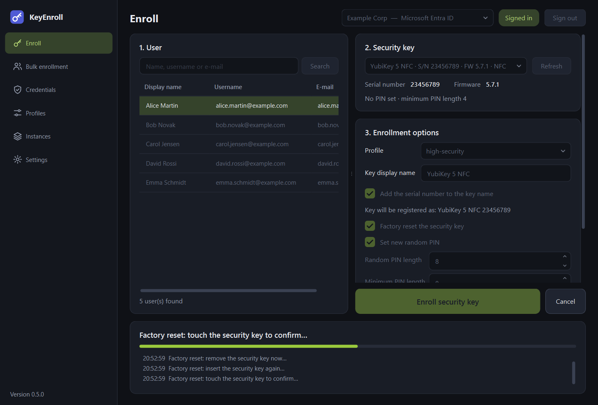
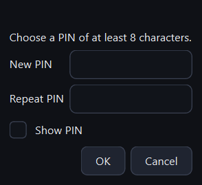

# Enrolling a key

The **Enroll** page prepares one security key and registers it for one user. It is
laid out as three numbered steps and a large button.

{ .shot }

## 1. User

| Control | What it is for |
|---|---|
| Search field | Type the beginning of a name, user name or e-mail address and press ++enter++ or **Search**. An empty search lists the first users of the directory. |
| User list | Select the user who will receive the key. Click a column header to sort. |
| Counter below the list | How many users matched. At most 25 are shown, so make the search more specific if the user is missing. |

You have to be [signed in](instances.md#signing-in) to search.

## 2. Security key

| Control | What it is for |
|---|---|
| Key selector | The connected security keys. A key that is plugged in or removed appears or disappears by itself within a couple of seconds. |
| **Refresh** | Looks for keys again immediately. |
| **Serial number**, **Firmware** | Read from the key, so that you can check you are holding the right one. Keys of the *Security Key* series do not reveal a serial number. |
| Status line | The state of the key before enrollment: whether a PIN is set, its minimum PIN length, and whether "always UV", Enterprise Attestation or a forced PIN change are active. |

Keys on an NFC reader are listed with the mark **NFC**.

## 3. Enrollment options

| Control | What it is for |
|---|---|
| **Profile** | The set of options to apply. Selecting a profile fills in the check boxes below. Selected automatically if the instance has a [default profile](instances.md). |
| **Key display name** | The name under which the identity provider stores the key, shown to the user in their list of sign-in methods. Optional. |
| **Add the serial number to the key name** | Appends the serial number, for example `YubiKey 5 NFC 23456789`. The line below shows the resulting name. |
| Check boxes and PIN lengths | The options of the selected profile. You can change them here **for this one enrollment**; the stored profile is not modified. Each option is explained in [Profiles](profiles.md). |

!!! info "Key names differ between providers"
    Microsoft Entra ID limits the name to 30 characters; if it does not fit, the name
    is shortened and the serial number is kept. Okta names the key itself, after its
    model, and ignores this field.

## Starting the enrollment

Press **Enroll security key**. A confirmation shows the user, the key and what will
be done. If the profile includes a factory reset, it warns that all FIDO credentials
on the key will be erased.

{ .shot }

The panel at the bottom tells you what to do with the key and keeps a short log of
the steps. **Cancel** stops the enrollment at the next safe point.

What happens, in order:

1. **Sign-in and permissions are checked**, before the key is touched.
2. **Factory reset** (if selected). A security key only accepts a reset in the first
   seconds after it is plugged in, so you are asked to **remove the key, insert it
   again, and touch it** when it blinks.
3. **PIN.** Depending on the options, a random PIN is set, or you are asked to type
   one (see below).
4. **Key settings**: minimum PIN length, "always UV", Enterprise Attestation.
5. **The credential is created**: touch the key once more when asked.
6. **The credential is registered** with the identity provider.
7. **Forced PIN change** is switched on last (if selected), so that the temporary
   PIN still works during the enrollment itself.

### When you are asked for a PIN

{ .shot .dialog }

| Situation | What KeyEnroll does |
|---|---|
| *Set new random PIN* is on | Generates the PIN. You are not asked for anything. |
| *Set new random PIN* is off and the key has no PIN (new or just reset) | Asks you to choose a PIN and repeat it. |
| The key already has a PIN and is not being reset | Asks for the **current** PIN and shows the remaining attempts. Then it either replaces it with a random one or keeps it. |

A security key blocks its PIN after too many wrong attempts; a blocked key can only
be recovered with a factory reset.

## Handing the key over

When the enrollment is done, the result window opens.

{ .shot .dialog }

| Element | What it is for |
|---|---|
| User, user name, serial number, key name | What was enrolled, for your records. |
| **Temporary PIN** | The PIN set on the key. Shown only if KeyEnroll generated it. |
| **Copy PIN** | Copies only the PIN. |
| **Copy message** | Copies a complete message for the user, ready to paste into a chat or a ticket. |
| **E-mail draft…** | Opens a new message in your e-mail program, addressed to the user, with subject and text filled in. Nothing is sent until you send it yourself. |
| **Save to file…** | Saves the same text as a `.txt` file. |

The text of the message is yours to change in
[Settings → Message for the user](settings.md#message-for-the-user).

!!! warning "Treat the PIN as a secret"
    - The PIN is shown **only in this window** and is not stored anywhere. Once the
      window is closed it cannot be displayed again.
    - Send the PIN through a different channel than the key: if both travel
      together, whoever intercepts the parcel can use the key.
    - A copied PIN or message is removed from the clipboard after one minute.
    - A saved file contains the PIN in plain text. Delete it when the key has been
      handed over.

If the profile forces a PIN change, the user is asked to choose their own PIN the
first time they use the key, and the temporary PIN stops working.
