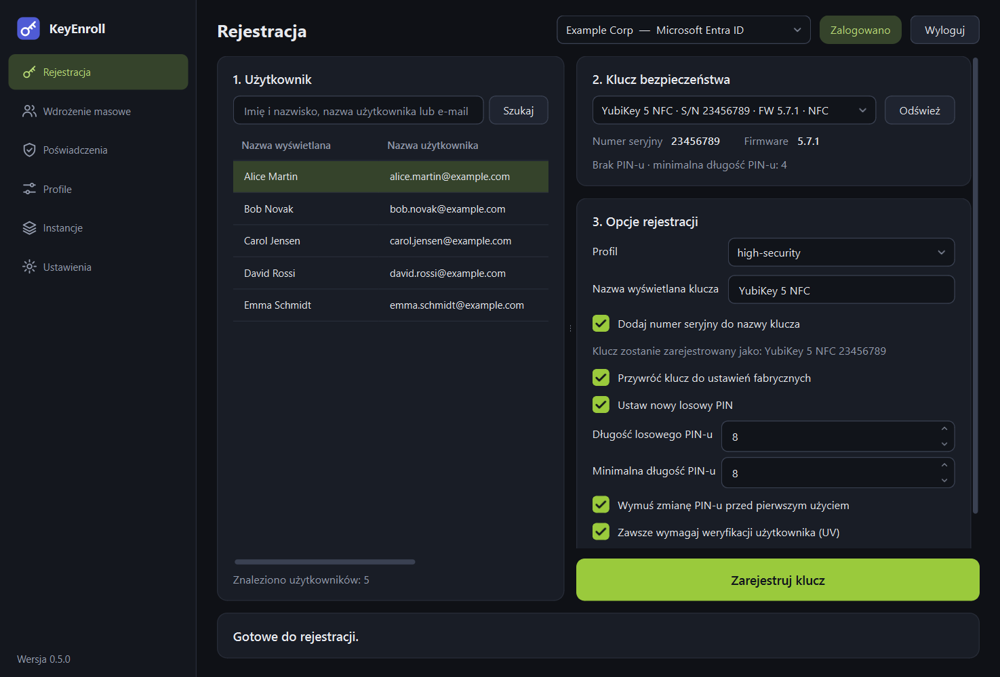
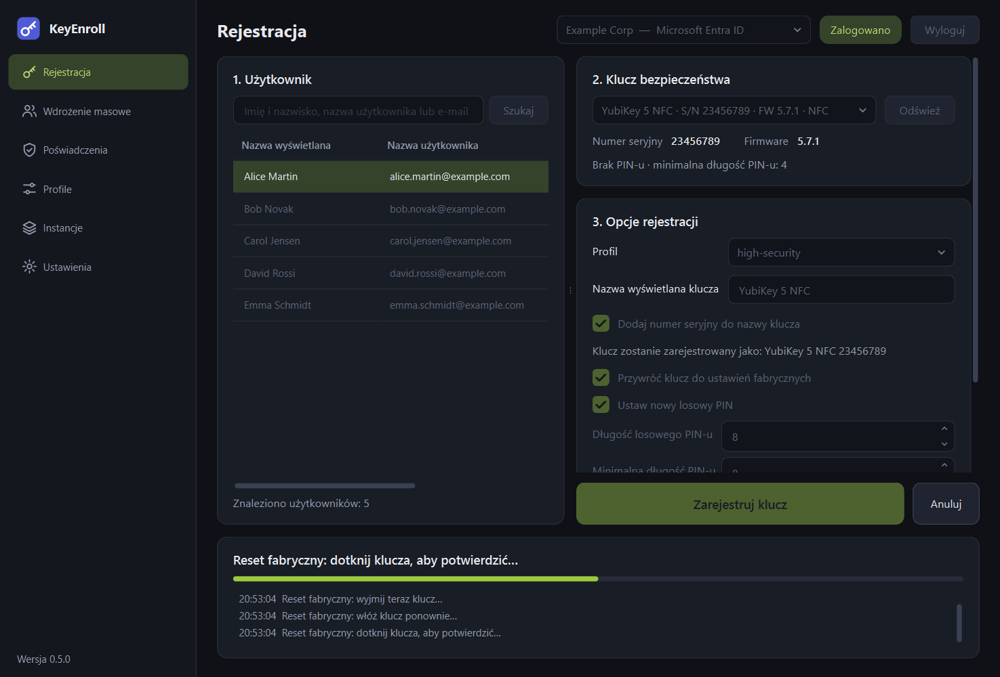
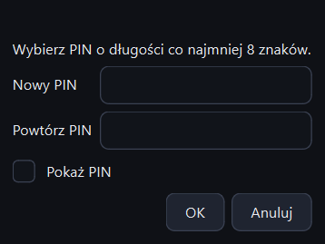
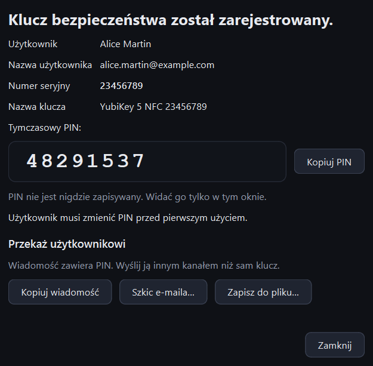

# Rejestracja klucza

Strona **Rejestracja** przygotowuje jeden klucz bezpieczeństwa i rejestruje go dla
jednego użytkownika. Składa się z trzech ponumerowanych kroków i dużego przycisku.

{ .shot }

## 1. Użytkownik { #1-user }

| Element | Do czego służy |
|---|---|
| Pole wyszukiwania | Wpisz początek imienia, nazwiska, nazwy użytkownika lub adresu e-mail i naciśnij ++enter++ albo **Szukaj**. Puste wyszukiwanie pokazuje pierwszych użytkowników katalogu. |
| Lista użytkowników | Zaznacz użytkownika, który dostanie klucz. Kliknięcie nagłówka kolumny sortuje listę. |
| Licznik pod listą | Ilu użytkowników znaleziono. Lista pokazuje najwyżej 25 osób, więc jeśli brakuje szukanej, zawęź wyszukiwanie. |

Wyszukiwanie wymaga [zalogowania](instances.md#signing-in).

## 2. Klucz bezpieczeństwa

| Element | Do czego służy |
|---|---|
| Lista kluczy | Podłączone klucze bezpieczeństwa. Włożony lub wyjęty klucz sam pojawia się lub znika w ciągu paru sekund. |
| **Odśwież** | Od razu szuka kluczy ponownie. |
| **Numer seryjny**, **Firmware** | Odczytane z klucza, żeby można było sprawdzić, czy to właściwy egzemplarz. Klucze z serii *Security Key* nie udostępniają numeru seryjnego. |
| Wiersz stanu | Stan klucza przed rejestracją: czy ma ustawiony PIN, jaka jest minimalna długość PIN-u oraz czy włączone są „zawsze wymagaj UV”, atestacja Enterprise lub wymuszona zmiana PIN-u. |

Klucze na czytniku NFC są oznaczone dopiskiem **NFC**.

## 3. Opcje rejestracji

| Element | Do czego służy |
|---|---|
| **Profil** | Zestaw opcji do zastosowania. Wybranie profilu ustawia pola poniżej. Wybierany automatycznie, jeśli instancja ma [profil domyślny](instances.md). |
| **Nazwa wyświetlana klucza** | Nazwa, pod którą dostawca tożsamości zapisze klucz i którą użytkownik zobaczy na liście swoich metod logowania. Pole opcjonalne. |
| **Dodaj numer seryjny do nazwy klucza** | Dopisuje numer seryjny, np. `YubiKey 5 NFC 23456789`. Wiersz poniżej pokazuje nazwę wynikową. |
| Pola wyboru i długości PIN-u | Opcje wybranego profilu. Możesz je tu zmienić **tylko dla tej jednej rejestracji**; zapisany profil się nie zmienia. Każdą opcję opisuje strona [Profile](profiles.md). |

!!! info "Nazwy kluczy u różnych dostawców"
    Microsoft Entra ID ogranicza nazwę do 30 znaków; jeśli się nie mieści, skracana
    jest nazwa, a numer seryjny zostaje. Okta sama nadaje kluczowi nazwę na podstawie
    modelu i ignoruje to pole.

## Uruchomienie rejestracji

Kliknij **Zarejestruj klucz**. Okno potwierdzenia pokazuje użytkownika, klucz i to,
co zostanie zrobione. Jeśli profil obejmuje reset fabryczny, ostrzega, że wszystkie
poświadczenia FIDO na kluczu zostaną usunięte.

{ .shot }

Panel na dole okna mówi, co zrobić z kluczem, i prowadzi krótki dziennik kroków.
**Anuluj** przerywa rejestrację w najbliższym bezpiecznym momencie.

Co dzieje się po kolei:

1. **Sprawdzenie logowania i uprawnień** — zanim klucz zostanie ruszony.
2. **Reset fabryczny** (jeśli wybrany). Klucz przyjmuje reset tylko w pierwszych
   sekundach po włożeniu, dlatego aplikacja prosi o **wyjęcie klucza, ponowne
   włożenie i dotknięcie go**, gdy zacznie migać.
3. **PIN.** Zależnie od opcji ustawiany jest losowy PIN albo aplikacja prosi
   o wpisanie go (patrz niżej).
4. **Ustawienia klucza**: minimalna długość PIN-u, „zawsze wymagaj UV”, atestacja
   Enterprise.
5. **Utworzenie poświadczenia**: dotknij klucza jeszcze raz, gdy aplikacja o to
   poprosi.
6. **Rejestracja poświadczenia** u dostawcy tożsamości.
7. **Wymuszenie zmiany PIN-u** jest włączane na końcu (jeśli wybrane), żeby
   tymczasowy PIN działał jeszcze w trakcie samej rejestracji.

### Kiedy aplikacja pyta o PIN

{ .shot .dialog }

| Sytuacja | Co robi KeyEnroll |
|---|---|
| Opcja *Ustaw nowy losowy PIN* jest włączona | Generuje PIN. O nic nie pyta. |
| Opcja *Ustaw nowy losowy PIN* jest wyłączona, a klucz nie ma PIN-u (nowy lub właśnie zresetowany) | Prosi o wybranie PIN-u i powtórzenie go. |
| Klucz ma już PIN i nie jest resetowany | Prosi o **obecny** PIN i pokazuje liczbę pozostałych prób. Potem zastępuje go losowym albo zostawia bez zmian. |

Klucz blokuje PIN po zbyt wielu błędnych próbach; zablokowany klucz można odzyskać
tylko resetem fabrycznym.

## Przekazanie klucza użytkownikowi { #handing-the-key-over }

Po zakończeniu rejestracji otwiera się okno wyniku.

{ .shot .dialog }

| Element | Do czego służy |
|---|---|
| Użytkownik, nazwa użytkownika, numer seryjny, nazwa klucza | Co zostało zarejestrowane — do Twojej ewidencji. |
| **Tymczasowy PIN** | PIN ustawiony na kluczu. Widoczny tylko wtedy, gdy wygenerował go KeyEnroll. |
| **Kopiuj PIN** | Kopiuje sam PIN. |
| **Kopiuj wiadomość** | Kopiuje gotową wiadomość dla użytkownika, do wklejenia np. w komunikatorze lub zgłoszeniu. |
| **Szkic e-maila…** | Otwiera w programie pocztowym nową wiadomość zaadresowaną do użytkownika, z tematem i treścią. Nic nie zostaje wysłane, dopóki nie wyślesz jej samodzielnie. |
| **Zapisz do pliku…** | Zapisuje ten sam tekst jako plik `.txt`. |

Treść wiadomości zmienisz w
[Ustawienia → Wiadomość dla użytkownika](settings.md#message-for-the-user).

!!! warning "Traktuj PIN jak tajemnicę"
    - PIN widać **tylko w tym oknie** i nie jest nigdzie zapisywany. Po zamknięciu
      okna nie da się go wyświetlić ponownie.
    - Wyślij PIN innym kanałem niż klucz: jeśli podróżują razem, każdy, kto
      przechwyci przesyłkę, może użyć klucza.
    - Skopiowany PIN lub wiadomość znika ze schowka po minucie.
    - Zapisany plik zawiera PIN jawnym tekstem. Usuń go po wydaniu klucza.

Jeśli profil wymusza zmianę PIN-u, użytkownik przy pierwszym użyciu klucza ustawi
własny PIN, a tymczasowy przestanie działać.
