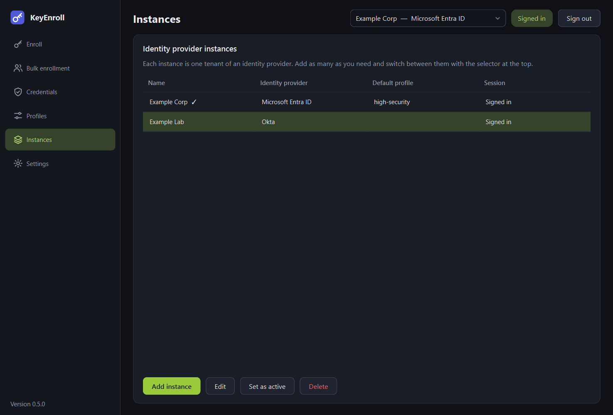
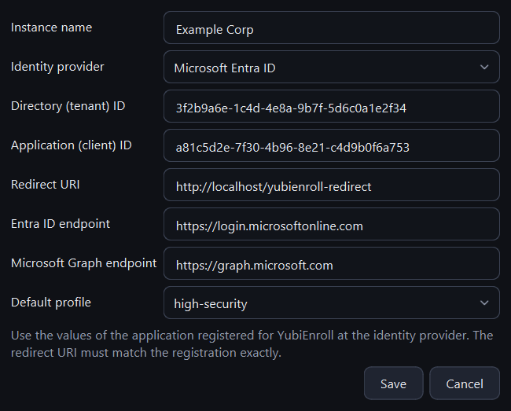

# Instances and sign-in

An **instance** is one tenant of an identity provider, together with the settings
KeyEnroll needs to reach it. You can keep any number of them — production and test
tenants, several customers, different providers — and switch between them without
leaving the application.

{ .shot }

## The page

| Column | Meaning |
|---|---|
| **Name** | The name you gave the instance. The active one is marked with ✓. |
| **Identity provider** | Entra ID, Okta, PingOne PingID or PingOne Advanced Identity Cloud. |
| **Default profile** | The [profile](profiles.md) preselected when this instance is active. |
| **Session** | Whether a sign-in is stored for this instance. |

| Button | What it is for |
|---|---|
| **Add instance** | Opens the form for a new instance. |
| **Edit** | Changes the selected instance. Double-clicking a row does the same. The identity provider of an existing instance cannot be changed. |
| **Set as active** | Makes the selected instance the one you work with. The selector at the top of the window does the same. |
| **Delete** | Removes the instance **and its stored sign-in** from this computer. Nothing is changed at the identity provider. |

## Adding an instance

{ .shot .dialog }

| Field | What to enter |
|---|---|
| **Instance name** | Any name that helps you recognise the tenant, for example *Production*. |
| **Identity provider** | The kind of tenant. The fields below change accordingly. |
| Provider fields | The values of the application registered at the identity provider. See [Identity providers](providers.md) for each field. |
| **Default profile** | Optional. |

!!! warning "The redirect URI must match exactly"
    The redirect URI has to be the same, character for character, as the one entered
    in the application registration at the identity provider — for Okta and Ping
    including the port number. It always starts with `http://localhost`. A mismatch is
    the most common reason for a failed sign-in.

## Switching instances

Use the selector at the top of the window. Searches, enrollments and the credential
list always work with the instance shown there. While an enrollment runs, the
selector is locked.

Each instance has its own sign-in, so switching does not sign you out anywhere.

## Signing in

Press **Sign in** in the top bar.

1. Your default browser opens the identity provider's sign-in page.
2. Sign in there with an administrator account, including multi-factor
   authentication if your organisation requires it.
3. The browser shows a short confirmation and you can return to KeyEnroll. The chip
   in the top bar turns to **Signed in**.

KeyEnroll never sees your password: the sign-in happens entirely in the browser, and
the application only receives a token from the identity provider.

**The sign-in is remembered.** It is stored in the credential store of the operating
system (Windows Credential Manager, macOS Keychain, or the Secret Service on Linux),
never in the settings file. How long it stays valid is decided by your identity
provider; when it expires you are asked to sign in again.

**Sign out** ends the session and removes the stored sign-in from this computer.

### What the account needs to be allowed to do

The signed-in administrator must be permitted to read users and to manage their
authentication methods. The exact role differs per provider, see
[Identity providers](providers.md). A missing permission shows up as an error from
the provider when you search for a user or start an enrollment.
