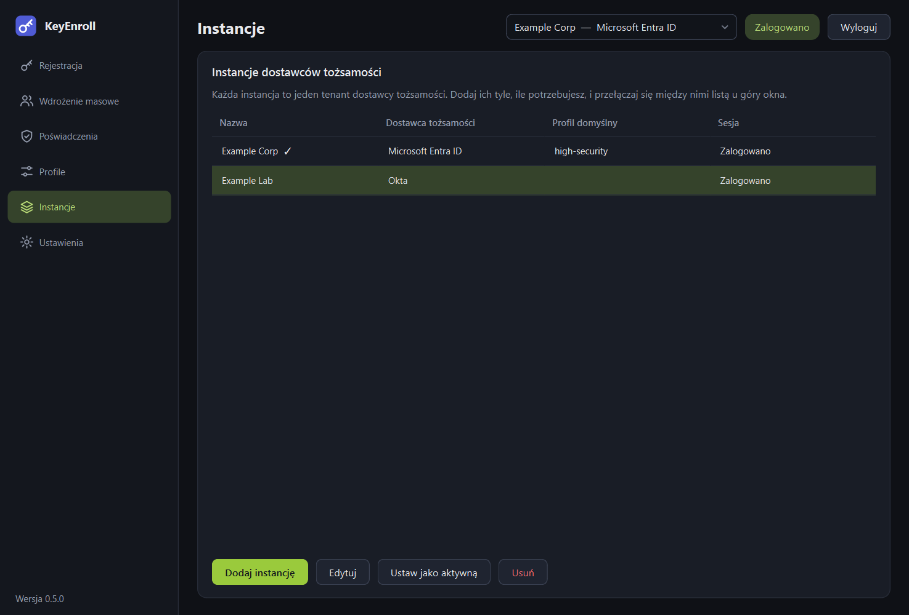

# Instancje i logowanie

**Instancja** to jeden tenant dostawcy tożsamości razem z ustawieniami, których
KeyEnroll potrzebuje, żeby się z nim połączyć. Możesz mieć ich dowolnie wiele —
tenanty produkcyjne i testowe, kilku klientów, różnych dostawców — i przełączać się
między nimi bez wychodzenia z aplikacji.

{ .shot }

## Strona

| Kolumna | Znaczenie |
|---|---|
| **Nazwa** | Nazwa nadana instancji. Aktywna jest oznaczona znakiem ✓. |
| **Dostawca tożsamości** | Entra ID, Okta, PingOne PingID lub PingOne Advanced Identity Cloud. |
| **Profil domyślny** | [Profil](profiles.md) wybierany, gdy ta instancja jest aktywna. |
| **Sesja** | Czy dla tej instancji jest zapisane logowanie. |

| Przycisk | Do czego służy |
|---|---|
| **Dodaj instancję** | Otwiera formularz nowej instancji. |
| **Edytuj** | Zmienia zaznaczoną instancję. To samo robi dwukrotne kliknięcie wiersza. Dostawcy tożsamości istniejącej instancji nie można zmienić. |
| **Ustaw jako aktywną** | Czyni zaznaczoną instancję tą, z którą pracujesz. To samo robi lista u góry okna. |
| **Usuń** | Usuwa z tego komputera instancję **wraz z zapisanym logowaniem**. U dostawcy tożsamości nic się nie zmienia. |

## Dodawanie instancji

{ .shot .dialog }

| Pole | Co wpisać |
|---|---|
| **Nazwa instancji** | Dowolna nazwa, po której rozpoznasz tenant, np. *Produkcja*. |
| **Dostawca tożsamości** | Rodzaj tenanta. Od niego zależą pola poniżej. |
| Pola dostawcy | Wartości aplikacji zarejestrowanej u dostawcy tożsamości. Każde pole opisuje strona [Dostawcy tożsamości](providers.md). |
| **Profil domyślny** | Opcjonalny. |

!!! warning "Redirect URI musi zgadzać się co do znaku"
    Redirect URI musi być dokładnie taki sam jak wpisany w rejestracji aplikacji
    u dostawcy tożsamości — u Okta i Ping łącznie z numerem portu. Zawsze zaczyna
    się od `http://localhost`. Niezgodność to najczęstsza przyczyna nieudanego
    logowania.

## Przełączanie instancji

Użyj listy u góry okna. Wyszukiwanie, rejestracje i lista poświadczeń zawsze
dotyczą instancji tam widocznej. W trakcie rejestracji lista jest zablokowana.

Każda instancja ma własne logowanie, więc przełączenie nigdzie Cię nie wylogowuje.

## Logowanie { #signing-in }

Kliknij **Zaloguj** na górnym pasku.

1. W domyślnej przeglądarce otworzy się strona logowania dostawcy tożsamości.
2. Zaloguj się tam kontem administratora, z uwierzytelnianiem wieloskładnikowym,
   jeśli Twoja organizacja go wymaga.
3. Przeglądarka pokaże krótkie potwierdzenie i można wrócić do KeyEnroll. Znacznik
   na górnym pasku zmieni się na **Zalogowano**.

KeyEnroll nigdy nie widzi Twojego hasła: logowanie odbywa się w całości
w przeglądarce, a aplikacja dostaje od dostawcy tożsamości jedynie token.

**Logowanie jest zapamiętywane.** Trafia do systemowego magazynu poświadczeń
(Menedżer poświadczeń Windows, Pęk kluczy macOS albo Secret Service w Linuksie),
nigdy do pliku ustawień. O tym, jak długo jest ważne, decyduje dostawca tożsamości;
gdy wygaśnie, aplikacja poprosi o ponowne zalogowanie.

**Wyloguj** kończy sesję i usuwa zapisane logowanie z tego komputera.

### Co musi móc konto

Zalogowany administrator musi mieć prawo odczytywać użytkowników i zarządzać ich
metodami uwierzytelniania. Konkretna rola zależy od dostawcy, patrz
[Dostawcy tożsamości](providers.md). Brak uprawnienia objawia się błędem dostawcy
przy wyszukiwaniu użytkownika albo na początku rejestracji.
