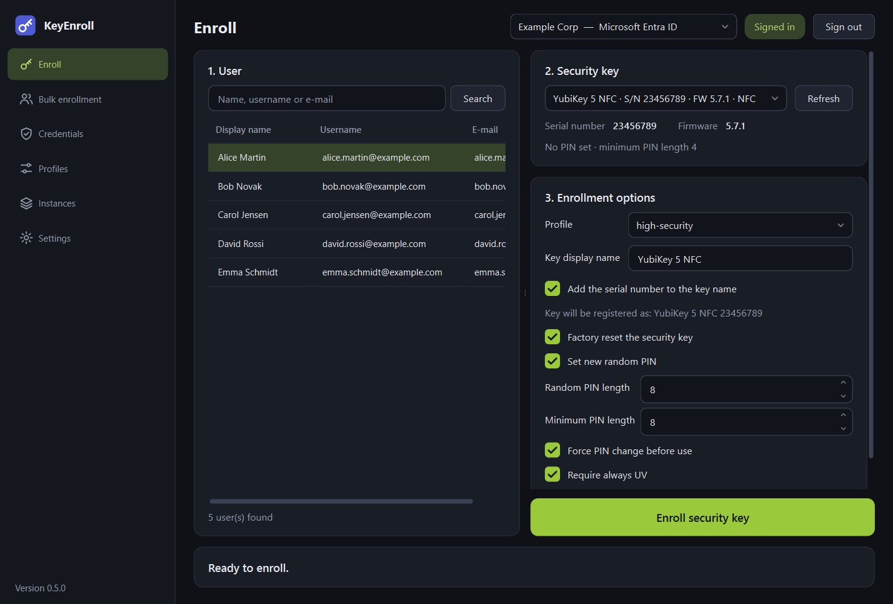

# The window at a glance

This page explains what every part of the window is for. Each page of the
application has its own chapter with the details.

{ .shot }

## The three areas

**Sidebar (left).** Switches between the six pages of the application. The version
you are running is shown at the bottom.

**Top bar.** Belongs to every page:

| Element | What it is for |
|---|---|
| Page title | The page you are on. |
| Instance selector | The tenant you are working with. Everything you search, enroll or delete applies to the instance selected here. See [Instances and sign-in](instances.md). |
| Session chip | **Signed in** (green) or **Not signed in** for the selected instance. |
| **Sign in** / **Sign out** | Opens the identity provider's sign-in page in your browser, or ends the session and forgets the stored sign-in. |

**Page (centre).** The work area of the selected page.

On Windows a yellow banner appears above the page when the application was started
without administrator rights; see [Installation](install.md#windows).

## The pages

| Page | Use it to | Details |
|---|---|---|
| **Enroll** | Prepare one key and register it for one user. | [Enrolling a key](enroll.md) |
| **Bulk enrollment** | Enroll keys for a whole list of users loaded from a file, and export the temporary PINs. | [Bulk enrollment](bulk.md) |
| **Credentials** | See which security keys a user has registered, and delete one. | [Credentials](credentials.md) |
| **Profiles** | Define reusable sets of enrollment options. | [Profiles](profiles.md) |
| **Instances** | Add, edit and remove identity provider tenants. | [Instances and sign-in](instances.md) |
| **Settings** | Colours, language, the message for the user, updates, logs. | [Settings](settings.md) |

## Things that work everywhere

**Sorting tables.** Click a column header to sort a list of users, credentials or
instances; click again to reverse the order, and a third time to return to the
original order. Upper and lower case are treated alike, and numbers inside names are
compared as numbers (`user2` comes before `user10`).

**Column widths.** Drag the border between two column headers. Wide lists scroll
sideways instead of cutting text off.

**The divider on the Enroll page.** Drag the border between the user list and the
options to give either side more room.

**Window layout.** The size and position of the window and of the divider are
remembered.

**Copying a PIN.** Whenever you copy a PIN or a message that contains one, the
clipboard is cleared again after one minute.

**While an enrollment runs.** The instance selector and the sign-in button are
locked, and closing the window asks for confirmation first.
