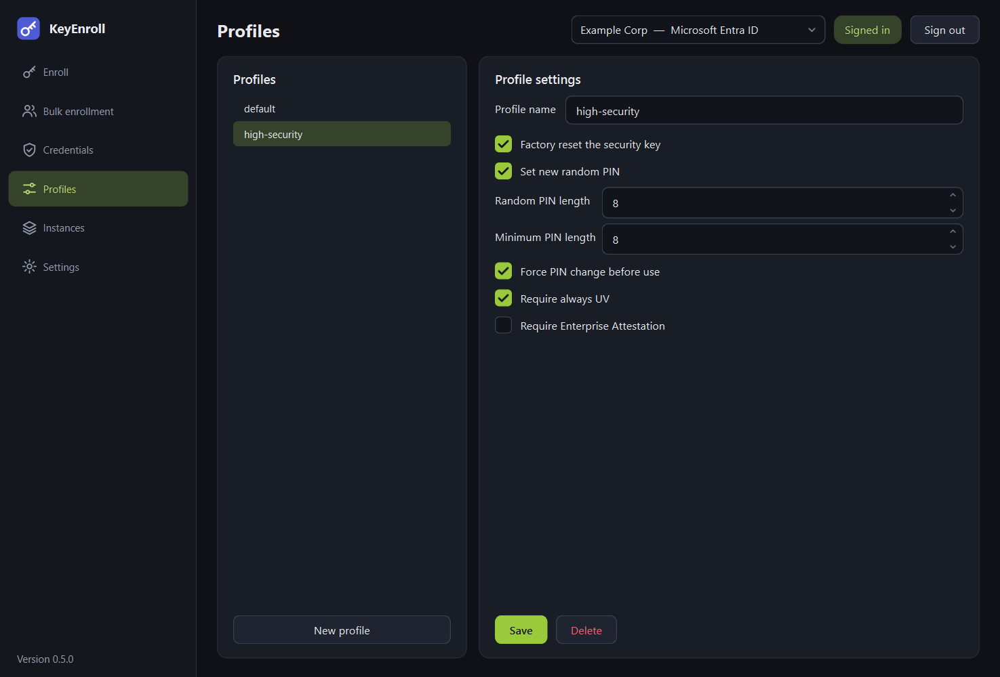

# Profiles

A profile is a named set of enrollment options. Instead of ticking the same boxes
for every key, you choose a profile on the [Enroll](enroll.md) or
[Bulk enrollment](bulk.md) page.

{ .shot }

## The page

| Control | What it is for |
|---|---|
| List on the left | The stored profiles. Select one to see and edit it. |
| **New profile** | Starts an empty profile with the default options. |
| **Profile name** | The name shown in the profile selectors. |
| **Save** | Stores the changes. |
| **Delete** | Removes the selected profile. |

A profile called `default` exists from the start. An [instance](instances.md) can
name a default profile, which is then preselected whenever that instance is active.

## The options

### Factory reset the security key

Erases **all FIDO credentials and the PIN** on the key before enrolling it.

- **On** (default): recommended for new keys and for keys that are reassigned. It
  guarantees a known starting point.
- **Off**: the existing credentials and PIN are kept. You are asked for the current
  PIN during enrollment. Use this to add your organisation's credential to a key the
  user already uses elsewhere.

A reset must be confirmed within a few seconds of plugging the key in, which is why
the application asks you to remove and re-insert it. Only the FIDO part of the key
is reset; other functions of a YubiKey (OTP, PIV, OpenPGP) are not affected.

### Set new random PIN

- **On** (default): KeyEnroll generates a numeric PIN and shows it when the
  enrollment is done.
- **Off**: you type the PIN yourself, or the key's existing PIN is kept.

Random PINs consist of digits, never start with a zero, and avoid trivial patterns
such as `111111` or `123456` that keys with PIN complexity rules would refuse.

### Random PIN length

The number of digits of the generated PIN, 4 to 63 (default 6). It cannot be shorter
than the minimum PIN length.

### Minimum PIN length

The shortest PIN the key will accept **from now on**, 4 to 63 (default 4). The user
cannot later choose a shorter PIN. A key never allows this value to be lowered again
without a factory reset.

### Force PIN change before use

The user has to replace the temporary PIN with one of their own the first time they
use the key. Combine it with a random PIN so that the administrator never knows the
user's final PIN.

### Require always UV

"Always require user verification": the key asks for the PIN **on every use**, even
when a website would not insist on it.

### Require Enterprise Attestation

Lets the key identify itself — including its serial number — to an identity provider
that requests *enterprise attestation*. This only works with keys that were ordered
with that feature and with a provider configured for it. Leave it off unless you
know you need it.

## What the key has to support

| Option | Requirement |
|---|---|
| Factory reset, PIN | Any FIDO2 key. |
| Minimum PIN length, forced PIN change, always UV | A key whose firmware offers authenticator configuration (YubiKey firmware 5.5 or newer). |
| Enterprise Attestation | A key manufactured with Enterprise Attestation. |

The application checks the key **before** it changes anything. If the key cannot do
what the profile asks, the enrollment stops with a message and the key is left
untouched.

## Examples

| Goal | Reset | Random PIN | PIN length | Minimum | Force change | Always UV |
|---|---|---|---|---|---|---|
| New keys handed out by IT | on | on | 6 | 6 | on | off |
| High-security accounts | on | on | 8 | 8 | on | on |
| Add a credential to the user's own key | off | off | — | 4 | off | off |
