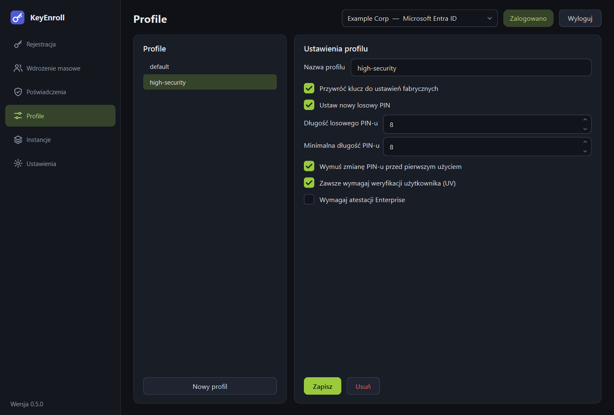

# Profile

Profil to nazwany zestaw opcji rejestracji. Zamiast zaznaczać te same pola dla
każdego klucza, wybierasz profil na stronie [Rejestracja](enroll.md) lub
[Wdrożenie masowe](bulk.md).

{ .shot }

## Strona

| Element | Do czego służy |
|---|---|
| Lista po lewej | Zapisane profile. Zaznacz profil, żeby go zobaczyć i edytować. |
| **Nowy profil** | Zaczyna pusty profil z opcjami domyślnymi. |
| **Nazwa profilu** | Nazwa widoczna na listach wyboru profilu. |
| **Zapisz** | Zapisuje zmiany. |
| **Usuń** | Usuwa zaznaczony profil. |

Profil o nazwie `default` istnieje od początku. [Instancja](instances.md) może mieć
wskazany profil domyślny, który jest wybierany, gdy ta instancja jest aktywna.

## Opcje

### Przywróć klucz do ustawień fabrycznych

Przed rejestracją usuwa z klucza **wszystkie poświadczenia FIDO oraz PIN**.

- **Włączone** (domyślnie): zalecane dla nowych kluczy i dla kluczy przekazywanych
  kolejnej osobie. Gwarantuje znany stan początkowy.
- **Wyłączone**: dotychczasowe poświadczenia i PIN zostają. W trakcie rejestracji
  aplikacja zapyta o obecny PIN. Użyj tego, żeby dodać poświadczenie Twojej
  organizacji do klucza, którego użytkownik używa już gdzie indziej.

Reset trzeba potwierdzić w ciągu kilku sekund od włożenia klucza — dlatego aplikacja
prosi o wyjęcie i ponowne włożenie. Resetowana jest tylko część FIDO; pozostałe
funkcje YubiKeya (OTP, PIV, OpenPGP) pozostają nietknięte.

### Ustaw nowy losowy PIN

- **Włączone** (domyślnie): KeyEnroll generuje numeryczny PIN i pokazuje go po
  zakończeniu rejestracji.
- **Wyłączone**: PIN wpisujesz samodzielnie albo zostaje dotychczasowy PIN klucza.

Losowe PIN-y składają się z cyfr, nigdy nie zaczynają się od zera i omijają banalne
układy w rodzaju `111111` czy `123456`, które klucze z regułami złożoności PIN-u
by odrzuciły.

### Długość losowego PIN-u

Liczba cyfr generowanego PIN-u, od 4 do 63 (domyślnie 6). Nie może być mniejsza niż
minimalna długość PIN-u.

### Minimalna długość PIN-u

Najkrótszy PIN, jaki klucz będzie **od tej pory** przyjmował, od 4 do 63 (domyślnie
4). Użytkownik nie ustawi później krótszego PIN-u. Tej wartości nie da się potem
zmniejszyć bez resetu fabrycznego.

### Wymuś zmianę PIN-u przed pierwszym użyciem

Przy pierwszym użyciu klucza użytkownik musi zastąpić tymczasowy PIN własnym.
W połączeniu z losowym PIN-em administrator nigdy nie poznaje ostatecznego PIN-u
użytkownika.

### Zawsze wymagaj weryfikacji użytkownika (UV)

Klucz pyta o PIN **przy każdym użyciu**, nawet jeśli witryna by tego nie wymagała.

### Wymagaj atestacji Enterprise

Pozwala kluczowi przedstawić się — łącznie z numerem seryjnym — dostawcy tożsamości,
który żąda *atestacji Enterprise*. Działa tylko z kluczami zamówionymi z tą funkcją
i z dostawcą odpowiednio skonfigurowanym. Zostaw wyłączone, jeśli nie masz pewności,
że tego potrzebujesz.

## Co musi obsługiwać klucz { #what-the-key-has-to-support }

| Opcja | Wymaganie |
|---|---|
| Reset fabryczny, PIN | Dowolny klucz FIDO2. |
| Minimalna długość PIN-u, wymuszona zmiana PIN-u, zawsze wymagaj UV | Klucz, którego firmware pozwala na konfigurację (YubiKey z firmware 5.5 lub nowszym). |
| Atestacja Enterprise | Klucz wyprodukowany z atestacją Enterprise. |

Aplikacja sprawdza klucz, **zanim** cokolwiek na nim zmieni. Jeśli klucz nie potrafi
tego, czego wymaga profil, rejestracja kończy się komunikatem, a klucz pozostaje
nienaruszony.

## Przykłady

| Cel | Reset | Losowy PIN | Długość PIN-u | Minimum | Wymuszona zmiana | Zawsze UV |
|---|---|---|---|---|---|---|
| Nowe klucze wydawane przez IT | tak | tak | 6 | 6 | tak | nie |
| Konta o podwyższonym ryzyku | tak | tak | 8 | 8 | tak | tak |
| Dodanie poświadczenia do własnego klucza użytkownika | nie | nie | — | 4 | nie | nie |
