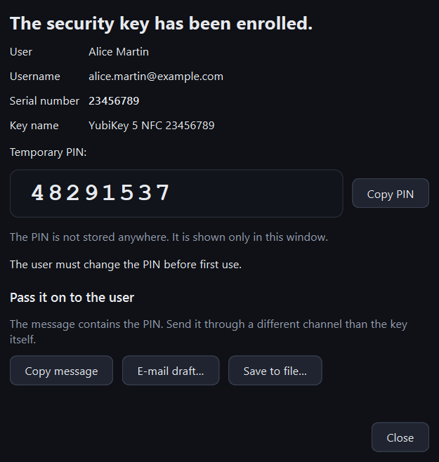

# Quick start

From an empty application to the first enrolled key. You need:

- KeyEnroll [installed](install.md),
- an application registered for key enrollment at your identity provider
  ([what is needed](providers.md)),
- an administrator account that is allowed to manage users' authentication methods,
- a security key and a test user.

## 1. Add an instance

An *instance* is one tenant of an identity provider. On the first start the
application opens the **Instances** page.

Choose **Add instance**, pick the identity provider, give the instance a name of your
own and fill in the values from the application registration.

{ .shot .dialog }

The fields differ per provider; they are explained in [Identity providers](providers.md).

## 2. Sign in

Press **Sign in** in the top right corner. Your browser opens the identity provider's
sign-in page. When you have finished there, return to KeyEnroll: the chip next to the
button turns to **Signed in**.

The sign-in is remembered, so next time you can start working straight away.

## 3. Choose the enrollment options

Open **Profiles**. A profile is a set of options that decide what happens to the key.
The built-in `default` profile:

- resets the key to factory settings,
- sets a random 6-digit PIN.

That is a sensible start. [Profiles](profiles.md) explains every option.

## 4. Enroll the key

Open **Enroll** and work from left to right:

1. **User** — type a name and press **Search**, then select the user.
2. **Security key** — plug the key in. It appears with its serial number and firmware.
3. **Enrollment options** — pick the profile and, if you like, type a name for the key.

Press **Enroll security key**, confirm, and follow the instructions at the bottom of
the window. With a factory reset you are asked to remove the key, insert it again and
touch it; then to touch it once more to create the credential.

## 5. Hand the key over

When the enrollment is done, a window shows the temporary PIN.

{ .shot .dialog }

!!! warning "The PIN is shown only here"
    KeyEnroll does not store PINs. Copy the PIN or the message, or save it to a file,
    before you close this window.

Give the key to the user and send the PIN **through a different channel**. That is
all: the user can now sign in with the key.

## What next

- Many keys to prepare? See [Bulk enrollment](bulk.md).
- Want to understand every control? See [The window at a glance](interface.md).
- Something did not work? See [Troubleshooting](troubleshooting.md).
