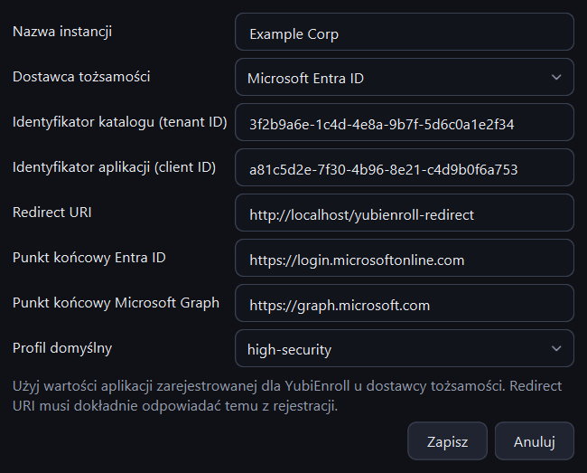

# Szybki start

Od pustej aplikacji do pierwszego zarejestrowanego klucza. Potrzebujesz:

- [zainstalowanego](install.md) KeyEnroll,
- aplikacji zarejestrowanej u dostawcy tożsamości na potrzeby rejestracji kluczy
  ([co jest potrzebne](providers.md)),
- konta administratora, które może zarządzać metodami uwierzytelniania użytkowników,
- klucza bezpieczeństwa i użytkownika testowego.

## 1. Dodaj instancję

*Instancja* to jeden tenant dostawcy tożsamości. Przy pierwszym uruchomieniu
aplikacja otwiera stronę **Instancje**.

Wybierz **Dodaj instancję**, wskaż dostawcę tożsamości, nadaj instancji własną nazwę
i wpisz wartości z rejestracji aplikacji.

{ .shot .dialog }

Pola zależą od dostawcy; opisuje je strona [Dostawcy tożsamości](providers.md).

## 2. Zaloguj się

Kliknij **Zaloguj** w prawym górnym rogu. W przeglądarce otworzy się strona logowania
dostawcy tożsamości. Po zalogowaniu wróć do KeyEnroll: znacznik obok przycisku zmieni
się na **Zalogowano**.

Logowanie jest zapamiętywane, więc następnym razem możesz od razu zacząć pracę.

## 3. Wybierz opcje rejestracji

Otwórz stronę **Profile**. Profil to zestaw opcji decydujących o tym, co stanie się
z kluczem. Wbudowany profil `default`:

- przywraca klucz do ustawień fabrycznych,
- ustawia losowy, 6-cyfrowy PIN.

To rozsądny początek. Wszystkie opcje opisuje strona [Profile](profiles.md).

## 4. Zarejestruj klucz

Otwórz stronę **Rejestracja** i idź od lewej do prawej:

1. **Użytkownik** — wpisz nazwisko i kliknij **Szukaj**, potem zaznacz użytkownika.
2. **Klucz bezpieczeństwa** — włóż klucz. Pojawi się z numerem seryjnym i wersją
   firmware.
3. **Opcje rejestracji** — wybierz profil i, jeśli chcesz, wpisz nazwę klucza.

Kliknij **Zarejestruj klucz**, potwierdź i wykonuj polecenia wyświetlane na dole
okna. Przy resecie fabrycznym aplikacja poprosi o wyjęcie klucza, ponowne włożenie
i dotknięcie go, a potem o jeszcze jedno dotknięcie, żeby utworzyć poświadczenie.

## 5. Przekaż klucz

Po zakończeniu rejestracji pojawi się okno z tymczasowym PIN-em.

{ .shot .dialog }

!!! warning "PIN widać tylko tutaj"
    KeyEnroll nie zapisuje PIN-ów. Zanim zamkniesz to okno, skopiuj PIN lub
    wiadomość albo zapisz je do pliku.

Wydaj klucz użytkownikowi, a PIN wyślij **innym kanałem**. To wszystko: użytkownik
może się już logować kluczem.

## Co dalej

- Masz do przygotowania wiele kluczy? Zobacz [Wdrożenie masowe](bulk.md).
- Chcesz poznać każdy element okna? Zobacz [Okno aplikacji w skrócie](interface.md).
- Coś nie zadziałało? Zobacz [Rozwiązywanie problemów](troubleshooting.md).
