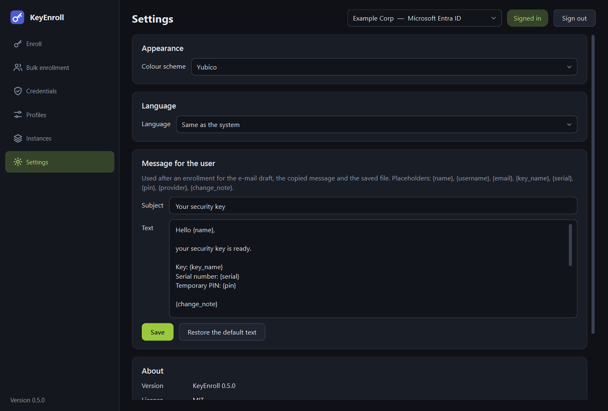
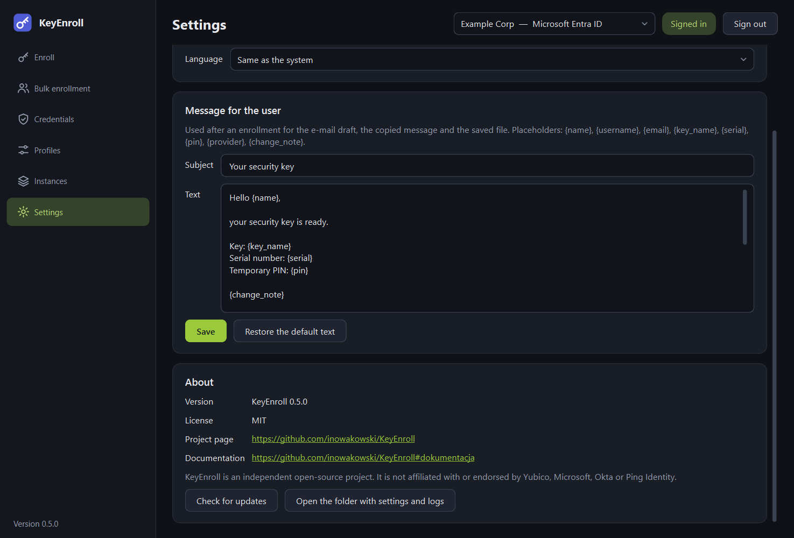

# Settings

{ .shot }

## Appearance

**Colour scheme** changes the look of the application immediately.

| Choice | Result |
|---|---|
| **Yubico** | Dark with a green accent. The default. |
| **Light** | Light background with a violet-blue accent. |
| **Dark** | Dark background with a violet-blue accent. |
| **Same as the system (light or dark)** | Follows the light or dark mode of the operating system. |
| **Custom** | Shows two more controls: a light or dark base, and **Accent colour…** to pick any colour for buttons and highlights. |

## Language

English, German, Spanish, French, Italian and Polish. **Same as the system** uses
the display language of the operating system if it is one of these, and English
otherwise.

A change of language takes effect **after the application is restarted**.

!!! note "About the translations"
    The German, Spanish, French and Italian translations have not yet been reviewed
    by native speakers. Corrections are welcome in the project's
    [issue tracker](https://github.com/inowakowski/KeyEnroll/issues).

## Message for the user

The text used when you [hand a key over](enroll.md#handing-the-key-over): for the
e-mail draft, the copied message and the saved file.

| Control | What it is for |
|---|---|
| **Subject** | Subject of the e-mail, and first line of the saved file. |
| **Text** | The body of the message. |
| **Save** | Stores your text. |
| **Restore the default text** | Returns to the built-in message, which follows the language of the application. |

Use these placeholders; they are replaced with the data of the enrollment:

| Placeholder | Replaced with |
|---|---|
| `{name}` | The user's display name. |
| `{username}` | The user name (login). |
| `{email}` | The user's e-mail address. |
| `{key_name}` | The name the key was registered under. |
| `{serial}` | The serial number of the key. |
| `{pin}` | The temporary PIN. If you typed the PIN yourself, a note that it is provided separately. |
| `{provider}` | The identity provider, for example *Microsoft Entra ID*. |
| `{change_note}` | A sentence telling the user they will have to choose their own PIN — only if the profile forces a PIN change, otherwise empty. |

A placeholder that is misspelt is left in the text as it is, so check a message once
after changing the template.

## About

{ .shot }

| Element | What it is for |
|---|---|
| **Version**, **License** | The version you are running. Quote it when you report a problem. |
| **Project page** | The source code and the issue tracker on GitHub. |
| **Documentation** | Opens the section of the project page that says where this documentation is published. |
| **Check for updates** | Asks GitHub whether a newer release has been published. If so, **Open the download page** appears. Nothing is downloaded or installed automatically, and the application never checks by itself. |
| **Open the folder with settings and logs** | Opens the folder that holds the settings file and the `logs` folder. See [Data and security](data.md). |
