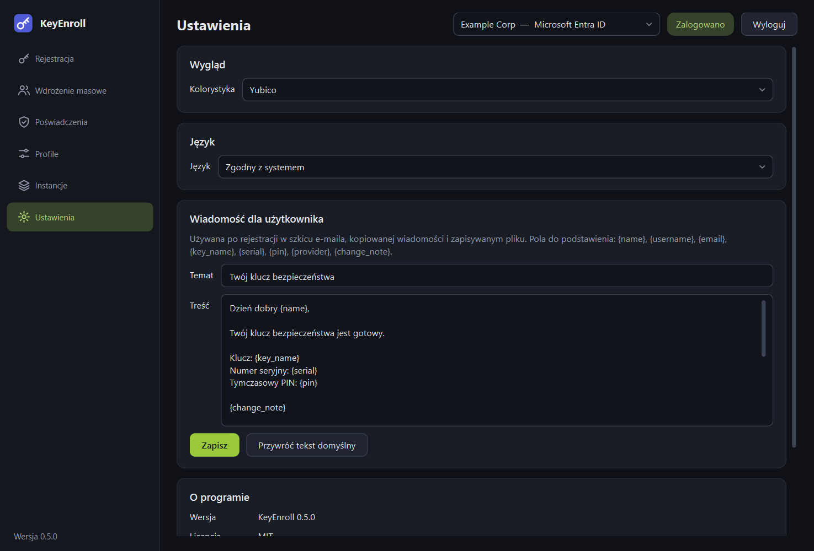
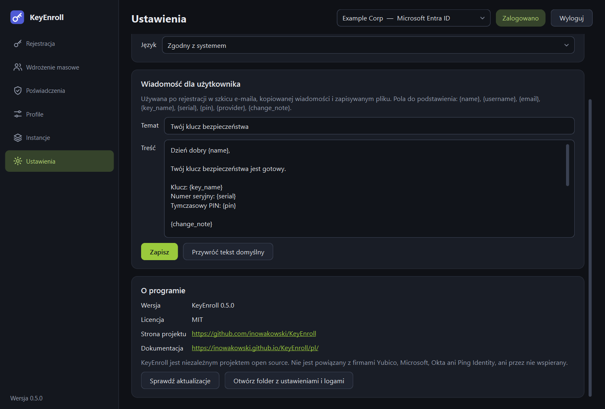

# Ustawienia

{ .shot }

## Wygląd

**Kolorystyka** zmienia wygląd aplikacji natychmiast.

| Wybór | Efekt |
|---|---|
| **Yubico** | Ciemna z zielonym akcentem. Domyślna. |
| **Jasny** | Jasne tło z fioletowoniebieskim akcentem. |
| **Ciemny** | Ciemne tło z fioletowoniebieskim akcentem. |
| **Zgodna z systemem (jasna lub ciemna)** | Podąża za jasnym lub ciemnym trybem systemu operacyjnego. |
| **Własny** | Pokazuje dwa dodatkowe elementy: jasną lub ciemną bazę oraz **Kolor akcentu…**, którym wybierzesz dowolny kolor przycisków i wyróżnień. |

## Język

Polski, angielski, niemiecki, hiszpański, francuski i włoski. **Zgodny z systemem**
używa języka interfejsu systemu operacyjnego, jeśli jest jednym z nich, a w innym
razie angielskiego.

Zmiana języka działa **po ponownym uruchomieniu aplikacji**.

!!! note "O tłumaczeniach"
    Tłumaczenia niemieckie, hiszpańskie, francuskie i włoskie nie były jeszcze
    sprawdzane przez osoby, dla których to język ojczysty. Poprawki są mile widziane
    w [zgłoszeniach projektu](https://github.com/inowakowski/KeyEnroll/issues).

## Wiadomość dla użytkownika { #message-for-the-user }

Tekst używany przy [przekazywaniu klucza](enroll.md#handing-the-key-over): w szkicu
e-maila, kopiowanej wiadomości i zapisywanym pliku.

| Element | Do czego służy |
|---|---|
| **Temat** | Temat e-maila oraz pierwszy wiersz zapisanego pliku. |
| **Treść** | Treść wiadomości. |
| **Zapisz** | Zapisuje Twój tekst. |
| **Przywróć tekst domyślny** | Wraca do wbudowanej wiadomości, która podąża za językiem aplikacji. |

Możesz używać poniższych pól; są zastępowane danymi rejestracji:

| Pole | Zastępowane przez |
|---|---|
| `{name}` | Nazwę wyświetlaną użytkownika. |
| `{username}` | Nazwę użytkownika (login). |
| `{email}` | Adres e-mail użytkownika. |
| `{key_name}` | Nazwę, pod którą zarejestrowano klucz. |
| `{serial}` | Numer seryjny klucza. |
| `{pin}` | Tymczasowy PIN. Jeśli PIN wpisano ręcznie — informację, że zostanie przekazany osobno. |
| `{provider}` | Dostawcę tożsamości, np. *Microsoft Entra ID*. |
| `{change_note}` | Zdanie informujące użytkownika, że będzie musiał ustawić własny PIN — tylko gdy profil wymusza zmianę PIN-u, w innym razie puste. |

Pole wpisane z błędem zostaje w tekście bez zmian, więc po zmianie szablonu warto
raz sprawdzić gotową wiadomość.

## O programie

{ .shot }

| Element | Do czego służy |
|---|---|
| **Wersja**, **Licencja** | Używana wersja. Podaj ją, zgłaszając problem. |
| **Strona projektu** | Kod źródłowy i zgłoszenia na GitHubie. |
| **Dokumentacja** | Otwiera tę dokumentację. |
| **Sprawdź aktualizacje** | Pyta GitHuba, czy opublikowano nowsze wydanie. Jeśli tak, pojawia się **Otwórz stronę pobierania**. Nic nie jest pobierane ani instalowane automatycznie, a aplikacja nigdy nie sprawdza aktualizacji sama. |
| **Otwórz folder z ustawieniami i logami** | Otwiera folder z plikiem ustawień i podfolderem `logs`. Zobacz [Dane i bezpieczeństwo](data.md). |
